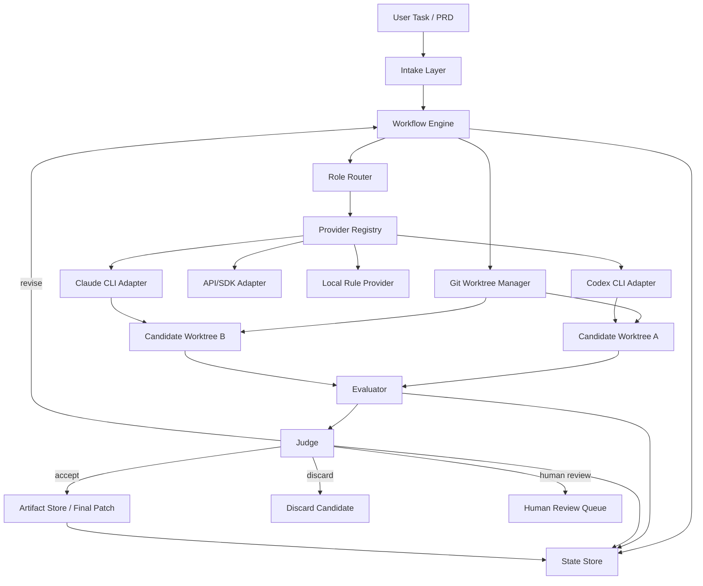
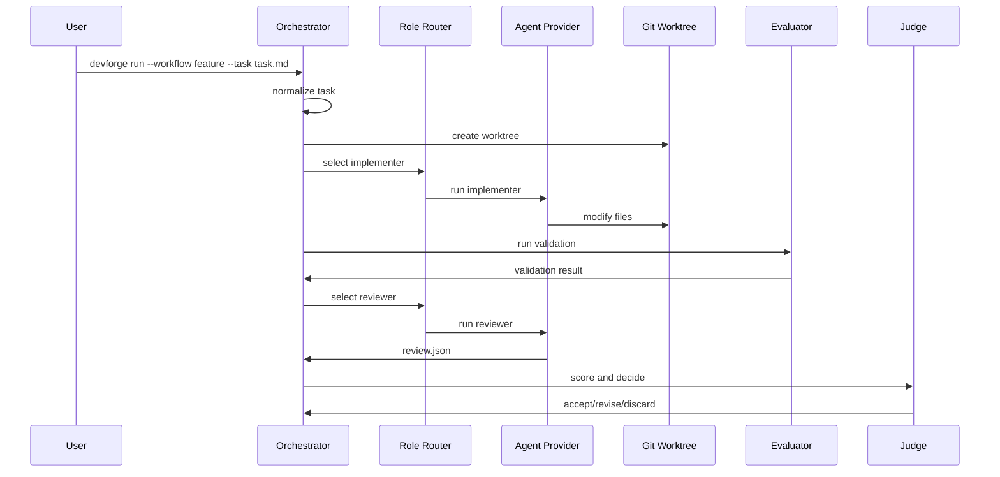
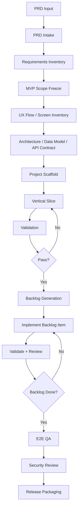

# AI Dev Orchestrator 아키텍처 설계서

문서 버전: v1.0  
작성일: 2026-05-11  
대상 제품명: **AI Dev Orchestrator**

---

## 1. 아키텍처 목표

AI Dev Orchestrator의 아키텍처 목표는 다음이다.

1. **Provider 독립성**
   - Claude Code, Codex, API provider, 향후 Gemini/Aider/로컬 모델을 동일한 인터페이스로 다룬다.

2. **역할 기반 routing**
   - 기획, 설계, 구현, 리뷰, QA, 보안, judge 역할을 provider와 분리한다.

3. **검증 중심 workflow**
   - LLM 응답 품질이 아니라 build/test/lint/typecheck/e2e/acceptance coverage를 기준으로 patch를 평가한다.

4. **격리와 롤백**
   - 모든 구현 후보는 git worktree에서 실행한다.
   - 실패한 후보는 discard하고 main working tree를 오염시키지 않는다.

5. **end-to-end app generation 지원**
   - PRD 입력부터 요구사항 정규화, architecture, scaffold, vertical slice, backlog 구현, QA, release packaging까지 DAG workflow로 구성한다.

6. **관찰성**
   - 모든 prompt, output, patch, validation result, score, decision을 저장한다.

---

## 2. 전체 시스템 구조



---

## 3. 핵심 설계 원칙

## 3.1 Orchestrator가 통제권을 가진다

Claude Code와 Codex는 독립 agent가 아니라 bounded worker로 취급한다.

```text
Orchestrator:
- workflow 결정
- provider 선택
- worktree 생성
- prompt 생성
- validation 실행
- 점수 계산
- accept/revise/discard 결정

Provider:
- 주어진 역할과 prompt를 수행
- patch 또는 report 생성
- stdout/stderr 반환
```

## 3.2 LLM 판단은 보조 신호다

최종 accept 여부는 다음 순서로 결정한다.

```text
1. deterministic policy
   - blocked file modified?
   - secret leaked?
   - destructive command attempted?
   - build failed?
   - tests deleted?

2. mechanical evaluation
   - build/test/lint/typecheck/e2e result
   - acceptance criteria coverage
   - diff size
   - changed file scope

3. LLM review
   - requirement coverage review
   - regression risk
   - security concern
   - maintainability concern

4. judge decision
   - accept / revise / discard / human_review
```

## 3.3 같은 provider의 자기검토를 피한다

```text
Codex 구현 → Claude 리뷰
Claude 구현 → Codex 리뷰
둘 다 구현 → cross-review
최종 judge → local deterministic evaluator 우선
```

---

## 4. 모듈 구성

```text
ai-dev-orchestrator/
  devforge/
    cli.py
    core/
      workflow_engine.py
      state_store.py
      role_router.py
      policy_engine.py
      artifact_store.py
      config_loader.py
      prompt_renderer.py
    providers/
      base.py
      codex_cli.py
      claude_cli.py
      openai_api.py
      anthropic_agent_sdk.py
      local_rule_based.py
    git/
      worktree_manager.py
      diff_collector.py
      patch_manager.py
    evaluators/
      validation_runner.py
      file_policy_checker.py
      command_policy_checker.py
      secret_scanner.py
      test_result_parser.py
      acceptance_checker.py
      score_calculator.py
    workflows/
      feature.yaml
      bugfix.yaml
      refactor.yaml
      code_review_only.yaml
      app_from_prd.yaml
      research_optimize.yaml
    prompts/
      roles/
        product_manager.md
        system_architect.md
        technical_planner.md
        implementer.md
        reviewer.md
        qa_engineer.md
        security_reviewer.md
        release_manager.md
      schemas/
        review.schema.json
        requirements.schema.json
        plan.schema.json
    project_profiles/
      node_react.yaml
      python_fastapi.yaml
      unity.yaml
      docker_fastapi.yaml
    dashboard/
      api.py
      web/
    tests/
```

---

## 5. Component 설계

## 5.1 Intake Layer

역할:

- task 또는 PRD 입력을 수집한다.
- 입력 유형을 분류한다.
- workflow를 선택한다.
- 문서/스크린샷/파일 입력을 normalized artifact로 변환한다.

입력 유형:

```text
- plain task: 기능 개발, 버그 수정, 리팩터링
- PRD/planning document: 앱 제작
- diff/PR: 리뷰 전용
- failed test log: 테스트 실패 원인 분석
```

출력:

```text
normalized_input.json
input_summary.md
workflow_selection.json
```

## 5.2 Workflow Engine

역할:

- workflow DAG를 로드한다.
- 각 stage의 role, provider, input/output schema를 결정한다.
- retry/revision loop를 관리한다.
- stop condition을 판단한다.

상태 전이:

```text
pending
→ running
→ validating
→ reviewing
→ judging
→ accepted | revising | discarded | human_review | failed
```

Pseudo-code:

```python
class WorkflowEngine:
    def run(self, workflow_id: str, input_ref: str) -> RunResult:
        run = self.state_store.create_run(workflow_id, input_ref)
        dag = self.load_workflow(workflow_id)

        for stage in dag.stages:
            result = self.execute_stage(run, stage)
            self.state_store.save_step(result)

            if result.decision == "revise":
                self.enqueue_revision(run, result)
            elif result.decision == "discard":
                self.discard_candidate(run, result)
            elif result.decision == "human_review":
                return self.pause_for_human(run, result)

        return self.finalize(run)
```

## 5.3 Role Router

역할:

- 역할별 provider 우선순위를 적용한다.
- healthcheck 결과를 반영한다.
- implementer와 reviewer가 같은 provider가 되지 않도록 한다.
- tournament mode를 처리한다.

입력:

```json
{
  "role": "implementer",
  "workflow": "feature",
  "required_capabilities": ["read_repo", "edit_files", "run_shell", "non_interactive"],
  "avoid_provider": null
}
```

출력:

```json
{
  "selected_providers": ["codex_sub_cli", "claude_sub_cli"],
  "mode": "tournament"
}
```

## 5.4 Provider Registry

역할:

- provider 설정을 로드한다.
- provider adapter를 생성한다.
- healthcheck를 수행한다.
- 실패 reason을 기록한다.

Provider 상태:

```text
enabled
available
unavailable_auth
unavailable_usage_limit
unavailable_command_missing
unavailable_timeout
disabled_by_policy
```

## 5.5 Agent Provider Adapter

공통 인터페이스:

```python
from dataclasses import dataclass
from pathlib import Path
from typing import Literal, Protocol

AgentRole = Literal[
    "product_manager",
    "system_architect",
    "technical_planner",
    "implementer",
    "reviewer",
    "qa_engineer",
    "security_reviewer",
    "release_manager",
    "judge",
]

@dataclass
class AgentRequest:
    role: AgentRole
    prompt: str
    cwd: Path
    run_id: str
    timeout_sec: int
    expected_output: Literal["text", "json", "patch", "report"]
    allow_edit: bool
    allow_shell: bool
    allowed_paths: list[str]
    blocked_paths: list[str]
    metadata: dict

@dataclass
class AgentResult:
    provider_id: str
    role: AgentRole
    success: bool
    stdout: str
    stderr: str
    parsed_json: dict | None
    changed_files: list[str]
    exit_code: int
    usage_hint: dict | None
    error: str | None

class AgentProvider(Protocol):
    provider_id: str

    def healthcheck(self) -> bool:
        ...

    def run(self, request: AgentRequest) -> AgentResult:
        ...

    def supports(self, capability: str) -> bool:
        ...
```

## 5.6 Codex CLI Adapter

실행 형태:

```bash
codex exec \
  --cd <worktree> \
  --sandbox workspace-write \
  --ask-for-approval never \
  --ephemeral \
  "<prompt>"
```

설계 포인트:

- subscription provider와 API provider를 config로 분리한다.
- non-interactive 실행에는 `--ask-for-approval never`를 사용하되, 외부에서 command policy와 sandbox를 적용한다.
- 위험한 full-access 플래그는 기본적으로 금지한다.
- stdout은 final message, stderr는 progress/log로 저장한다.

Adapter pseudo-code:

```python
class CodexCliProvider:
    def run(self, request: AgentRequest) -> AgentResult:
        sandbox = "workspace-write" if request.allow_edit else "read-only"
        cmd = [
            "codex", "exec",
            "--cd", str(request.cwd),
            "--sandbox", sandbox,
            "--ask-for-approval", "never",
            "--ephemeral",
            request.prompt,
        ]
        return self._run_subprocess(cmd, request)
```

## 5.7 Claude CLI Adapter

실행 형태:

```bash
claude -p "<prompt>" \
  --output-format json \
  --permission-mode acceptEdits \
  --tools "Read,Edit,Write,Bash" \
  --max-turns 20
```

설계 포인트:

- reviewer 역할은 `--permission-mode plan` 또는 edit disabled로 실행한다.
- implementer 역할은 `acceptEdits`를 사용할 수 있다.
- JSON schema가 필요한 역할은 `--json-schema`를 사용한다.
- `--worktree`는 Claude 자체 기능으로 존재하지만, orchestrator 일관성을 위해 기본은 외부 git worktree manager를 사용한다.

Adapter pseudo-code:

```python
class ClaudeCliProvider:
    def run(self, request: AgentRequest) -> AgentResult:
        tools = "Read,Edit,Write,Bash" if request.allow_edit else "Read,Grep,Glob"
        permission_mode = "acceptEdits" if request.allow_edit else "plan"
        cmd = [
            "claude", "-p", request.prompt,
            "--output-format", "json",
            "--permission-mode", permission_mode,
            "--tools", tools,
            "--max-turns", "20",
        ]
        return self._run_subprocess(cmd, request)
```

## 5.8 Git Worktree Manager

역할:

- candidate별 독립 worktree를 생성한다.
- branch naming을 관리한다.
- patch를 수집한다.
- discard/cleanup을 수행한다.

구조:

```text
repo/
  .orchestrator/
    runs/

../repo-worktrees/
  run-20260511-001-codex/
  run-20260511-001-claude/
  run-20260511-001-best/
```

명령:

```bash
git worktree add ../repo-worktrees/run-001-codex -b agent/run-001-codex main
git worktree add ../repo-worktrees/run-001-claude -b agent/run-001-claude main
```

## 5.9 Evaluator

Evaluator는 candidate patch를 기계적으로 검증한다.

하위 evaluator:

| Evaluator | 기능 |
|---|---|
| ValidationRunner | build/test/lint/typecheck/e2e 명령 실행 |
| FilePolicyChecker | allowed/blocked path 검증 |
| CommandPolicyChecker | 로그 기반 위험 명령 탐지 |
| SecretScanner | `.env`, token, key pattern 탐지 |
| TestMutationChecker | test 삭제/완화 탐지 |
| DiffAnalyzer | diff size, changed files, dependency change 탐지 |
| AcceptanceChecker | requirements.json 기준 충족률 계산 |
| ScoreCalculator | 점수 계산 |

## 5.10 Judge

Judge는 최종 결정을 내린다.

Decision types:

```text
accept
revise
discard
human_review
keep_candidate_but_continue
```

Judge pseudo-code:

```python
class Judge:
    def decide(self, evaluation: EvaluationBundle) -> Decision:
        if evaluation.secret_detected:
            return Decision("discard", reason="secret_detected")

        if evaluation.blocked_file_modified:
            return Decision("discard", reason="blocked_file_modified")

        if evaluation.test_deleted_or_weakened:
            return Decision("human_review", reason="test_integrity_risk")

        if not evaluation.build_pass:
            return Decision("revise", reason="build_failed")

        if evaluation.score >= 85 and evaluation.reviewer_verdict == "pass":
            return Decision("accept", reason="score_threshold_met")

        if evaluation.score > evaluation.previous_best_score:
            return Decision("keep_candidate_but_continue", reason="improved")

        return Decision("discard", reason="no_improvement")
```

## 5.11 Artifact Store

역할:

- 모든 run artifact를 저장한다.
- 파일 기반 저장 + SQLite index를 사용한다.

파일 구조:

```text
.orchestrator/
  runs/
    <run_id>/
      input.md
      normalized_task.json
      repo_context.md
      plan.json
      candidates/
        <candidate_id>/
          stdout.log
          stderr.log
          diff.patch
          validation.json
          review.json
          score.json
      decision.json
      final_report.md
```

---

## 6. Workflow 설계

## 6.1 Feature Workflow



Stage definition:

```yaml
workflow: feature
stages:
  - id: normalize_task
    role: technical_planner
    mode: read_only
    output: normalized_task.json

  - id: inspect_repo
    role: technical_planner
    mode: read_only
    output: repo_context.md

  - id: plan
    role: system_architect
    mode: read_only
    output: implementation_plan.json

  - id: implement_candidates
    role: implementer
    mode: tournament
    output: candidate_patches

  - id: run_validation
    type: local_evaluator
    output: validation.json

  - id: cross_review
    role: reviewer
    strategy: reviewer_not_same_as_implementer
    output: review.json

  - id: judge
    type: deterministic_plus_llm
    output: decision.json
```

## 6.2 App-from-PRD Workflow



Stage definition:

```yaml
workflow: app_from_prd
stages:
  - id: prd_intake
    role: product_manager
    output:
      - product_summary.md
      - requirements.json
      - ambiguity_log.json

  - id: product_spec_freeze
    role: product_manager
    output:
      - prd.normalized.md
      - assumptions.md
      - out_of_scope.md

  - id: ux_flow_design
    role: product_manager
    output:
      - user_flows.md
      - screen_inventory.json
      - navigation_map.md

  - id: architecture_design
    role: system_architect
    output:
      - architecture.md
      - data_model.md
      - api_contract.yaml

  - id: project_scaffold
    role: implementer
    output:
      - scaffold_patch

  - id: vertical_slice
    role: implementer
    goal: "Build one complete user journey from UI to persistence"
    output:
      - vertical_slice_patch

  - id: feature_backlog_generation
    role: technical_planner
    output:
      - backlog.json
      - milestones.json

  - id: implement_backlog
    role: implementer
    loop_over: backlog.items
    validation_after_each_item: true

  - id: qa_e2e
    role: qa_engineer
    output:
      - test_plan.md
      - e2e_tests
      - qa_report.json

  - id: security_privacy_review
    role: security_reviewer
    output:
      - security_review.md

  - id: release_packaging
    role: release_manager
    output:
      - README.md
      - deployment.md
      - release_notes.md
      - final_report.md
```

---

## 7. 데이터 모델

SQLite를 기본 state store로 사용한다.

```sql
CREATE TABLE runs (
  id TEXT PRIMARY KEY,
  workflow TEXT NOT NULL,
  status TEXT NOT NULL,
  created_at TEXT NOT NULL,
  completed_at TEXT,
  input_hash TEXT,
  project_root TEXT NOT NULL,
  final_score REAL
);

CREATE TABLE steps (
  id TEXT PRIMARY KEY,
  run_id TEXT NOT NULL,
  stage_id TEXT NOT NULL,
  role TEXT,
  provider_id TEXT,
  status TEXT NOT NULL,
  started_at TEXT,
  completed_at TEXT,
  stdout_path TEXT,
  stderr_path TEXT,
  artifact_path TEXT,
  FOREIGN KEY(run_id) REFERENCES runs(id)
);

CREATE TABLE candidates (
  id TEXT PRIMARY KEY,
  run_id TEXT NOT NULL,
  provider_id TEXT NOT NULL,
  worktree_path TEXT NOT NULL,
  branch_name TEXT NOT NULL,
  patch_path TEXT,
  score REAL,
  decision TEXT,
  FOREIGN KEY(run_id) REFERENCES runs(id)
);

CREATE TABLE evaluations (
  id TEXT PRIMARY KEY,
  candidate_id TEXT NOT NULL,
  evaluator TEXT NOT NULL,
  result_json TEXT NOT NULL,
  passed INTEGER NOT NULL,
  score REAL,
  FOREIGN KEY(candidate_id) REFERENCES candidates(id)
);

CREATE TABLE provider_status (
  provider_id TEXT PRIMARY KEY,
  status TEXT NOT NULL,
  last_checked_at TEXT NOT NULL,
  failure_reason TEXT,
  metadata_json TEXT
);
```

---

## 8. Config 설계

`devforge.yaml` 예시:

```yaml
project:
  name: my-app
  root: "C:/Projects/my-app"
  default_branch: main
  worktree_root: "C:/Projects/.agent-worktrees"
  profile: node_react

mode:
  max_iterations_per_task: 4
  max_candidates_per_task: 2
  keep_best_candidate: true

providers:
  codex_sub_cli:
    type: codex_cli
    enabled: true
    auth: chatgpt_subscription
    command: codex
    default_args:
      - "exec"
      - "--sandbox"
      - "workspace-write"
      - "--ask-for-approval"
      - "never"
      - "--ephemeral"

  codex_api_cli:
    type: codex_cli
    enabled: false
    auth: openai_api_key
    env_required:
      - OPENAI_API_KEY

  claude_sub_cli:
    type: claude_cli
    enabled: true
    auth: claude_subscription
    command: claude
    default_args:
      - "-p"
      - "--output-format"
      - "json"
      - "--permission-mode"
      - "acceptEdits"

  claude_api_sdk:
    type: claude_agent_sdk
    enabled: false
    auth: anthropic_api_key
    env_required:
      - ANTHROPIC_API_KEY

roles:
  product_manager:
    provider_order:
      - claude_sub_cli
      - codex_sub_cli

  implementer:
    provider_order:
      - codex_sub_cli
      - claude_sub_cli
    tournament: true

  reviewer:
    provider_order:
      - claude_sub_cli
      - codex_sub_cli
    avoid_same_provider_as_implementer: true

  judge:
    provider_order:
      - local_rule_based

validation:
  commands:
    lint: "npm run lint"
    typecheck: "npm run typecheck"
    test: "npm test"
    build: "npm run build"

file_policy:
  allowed_paths:
    - "src/**"
    - "app/**"
    - "tests/**"
    - "docs/**"
  blocked_paths:
    - ".git/**"
    - ".env"
    - ".env.*"
    - "secrets/**"
  require_human_review_if_modified:
    - "package-lock.json"
    - "Dockerfile"
    - "docker-compose.yml"
    - "infra/**"

command_policy:
  blocked_patterns:
    - "rm -rf"
    - "git push"
    - "git reset --hard"
    - "curl * | sh"
    - "sudo"
    - "docker system prune"

scoring:
  build_pass: 25
  tests_pass: 25
  lint_pass: 10
  typecheck_pass: 10
  acceptance_coverage: 20
  reviewer_pass: 10

stop_conditions:
  accept_when:
    build_pass: true
    tests_pass: true
    reviewer_verdict: pass
    min_score: 85
  discard_when:
    blocked_file_modified: true
    secret_detected: true
```

---

## 9. Prompt 구조

## 9.1 Prompt Renderer

Prompt는 다음 계층으로 합성한다.

```text
system/base policy
+ role prompt
+ workflow context
+ task/PRD input
+ repo context
+ constraints
+ output schema
+ provider-specific wrapper
```

## 9.2 Implementer Prompt

```markdown
You are an implementation agent working inside a real repository.

Task:
{{ task }}

Repository context:
{{ repo_context }}

Constraints:
{{ constraints }}

Allowed paths:
{{ allowed_paths }}

Blocked paths:
{{ blocked_paths }}

Acceptance criteria:
{{ acceptance_criteria }}

Rules:
1. Modify only necessary files.
2. Do not modify blocked paths.
3. Do not weaken or delete tests.
4. Do not add dependencies unless strictly necessary.
5. Prefer a small vertical slice over a broad incomplete implementation.
6. Run available validation commands if possible.
7. At the end, return a concise implementation summary.

Output:
- Changed files
- What was implemented
- What was not implemented
- Validation commands run
- Risks
```

## 9.3 Reviewer Prompt

```markdown
You are a strict senior software reviewer.

Review only the diff and the stated requirements.
Do not rewrite the code.
Do not suggest broad rewrites unless required.
Do not reward cosmetic changes.

Evaluate:
1. Requirement coverage
2. Build/test risk
3. Regression risk
4. Security/privacy risk
5. Unnecessary dependency or architecture changes
6. Test quality
7. Whether the patch should be accepted, revised, or rejected

Return JSON only:
{
  "verdict": "pass | needs_revision | reject",
  "requirement_coverage": 0.0,
  "critical_issues": [],
  "major_issues": [],
  "minor_issues": [],
  "test_concerns": [],
  "security_concerns": [],
  "recommended_revision_prompt": ""
}
```

## 9.4 PRD Intake Prompt

```markdown
You are a product manager converting a planning document into an executable software delivery plan.

Input planning document:
{{ planning_doc }}

Extract:
1. Product summary
2. Target users
3. Core user journeys
4. Functional requirements
5. Non-functional requirements
6. Screens/pages
7. Data entities
8. External integrations
9. Ambiguities
10. MVP scope
11. Out-of-scope items
12. Acceptance criteria

If the document is ambiguous, create explicit assumptions.
Do not block progress on questions unless the ambiguity makes implementation impossible.

Return JSON matching the schema.
```

---

## 10. 보안 설계

## 10.1 격리

- 모든 구현은 git worktree에서 실행한다.
- main working tree에서 직접 구현 agent를 실행하지 않는다.
- provider sandbox를 사용하되, sandbox를 절대 유일한 안전장치로 보지 않는다.
- blocked file 변경은 patch 단계에서 폐기한다.

## 10.2 Secrets

탐지 대상:

```text
- OPENAI_API_KEY
- ANTHROPIC_API_KEY
- Firebase private key
- AWS access key
- JWT secret
- .env file content
- OAuth secret
```

정책:

```text
secret detected in diff → discard
secret detected in stdout/stderr → redact log + human_review
.env modified → discard
```

## 10.3 Command Control

단순 stdout/stderr 분석만으로는 부족하므로, 초기에는 다음 두 단계를 사용한다.

1. Provider prompt에 command policy 삽입
2. Provider별 hooks/permission 또는 wrapper script로 위험 명령 차단

향후 Claude Agent SDK 또는 Codex MCP/SDK 기반으로 전환하면 tool call 수준에서 command interception을 구현한다.

---

## 11. CLI 설계

## 11.1 기본 명령

```bash
devforge init

devforge providers status

devforge run --workflow feature --task task.md

devforge run \
  --workflow feature \
  --task task.md \
  --implementer codex_sub_cli \
  --reviewer claude_sub_cli

devforge run \
  --workflow refactor \
  --task task.md \
  --tournament codex_sub_cli,claude_sub_cli

devforge create-app \
  --from app_plan.md \
  --stack react-fastapi-postgres

devforge report --run <run_id>

devforge apply --run <run_id> --candidate <candidate_id>

devforge cleanup --run <run_id>
```

## 11.2 Provider 상태 출력 예시

```text
Provider Status
---------------
codex_sub_cli      available      auth=chatgpt_subscription
claude_sub_cli     available      auth=claude_subscription
codex_api_cli      disabled       missing OPENAI_API_KEY
claude_api_sdk     disabled       missing ANTHROPIC_API_KEY
local_rule_based   available      auth=none
```

---

## 12. Dashboard 설계

MVP 이후 local dashboard를 제공한다.

## 12.1 Backend

- FastAPI
- SQLite
- artifact file reader
- diff API
- provider status API

## 12.2 Frontend

- React 또는 simple server-side rendered UI
- 기능:
  - run list
  - run detail
  - candidate comparison
  - diff viewer
  - validation result
  - review result
  - score trend
  - provider status

---

## 13. 확장 계획

## 13.1 Provider 확장

추가 가능한 provider:

```text
- OpenAI Agents SDK + Codex MCP
- Claude Agent SDK
- Gemini CLI
- Aider
- Cursor CLI/Agent if available
- local LLM reviewer
```

## 13.2 Workflow 확장

```text
- security_patch
- dependency_upgrade
- migration_planning
- test_generation
- documentation_generation
- release_note_generation
- CI_failure_repair
```

## 13.3 Evaluation 확장

```text
- mutation testing
- coverage delta
- performance benchmark
- dependency vulnerability scan
- license scan
- visual regression test
- mobile UI snapshot test
```

---

## 14. 참고 링크

- OpenAI Codex CLI: https://developers.openai.com/codex/cli
- OpenAI Codex non-interactive mode: https://developers.openai.com/codex/noninteractive
- OpenAI Codex authentication: https://developers.openai.com/codex/auth
- OpenAI Codex CLI reference: https://developers.openai.com/codex/cli/reference
- Anthropic Claude Code CLI reference: https://code.claude.com/docs/en/cli-reference
- Anthropic Claude Agent SDK overview: https://code.claude.com/docs/en/agent-sdk/overview
- Anthropic Claude Code hooks: https://code.claude.com/docs/en/hooks
- Anthropic Claude Code Pro/Max support: https://support.claude.com/en/articles/11145838-use-claude-code-with-your-pro-or-max-plan
